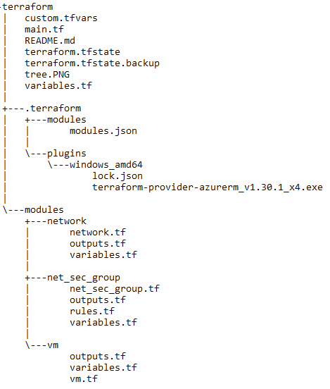

### Task 1
Get your Azure subscription's credentials
Read about how to connect Terraform with Azure: Azure Service Principal and Terraform Azure provider
Check out your subscription_id, client_id, client_secret, tenant_id
Install Terraform on your computer
Make a root folder for future tasks, create main.tf file and paste an Azure provider block inside it

### Task 2
Read about our project's naming conventions for Terraform code
Make a Terraform module for Network. It should deploy a Resource group, 1 Virtual network and 1 Subnet
Make a Terraform module for Virtual Machine. It should deploy just a single Linux VM with a minimal set of options and 1 Network
interface
Go to the root folder from previous task and mix all modules together
Provision your first infrastructure, make sure Terraform applied all stuff without errors, check newly created Resources at Azure portal
(within your Azure subscription)

### Task 3
Review your code, adjust all variables and styling according project's naming conventions
Add some major outputs inside your modules and pass them to root part. Log out some of these outputs in console
Add count attribute to VM module, so you can provision multiple VMs at once. Adjust other pieces of code accordingly
Add a Public IP allocation support. User might decide, whenever he wants to provision a bunch of VMs with Public IP or not
Provision all these improvements, make sure Terraform applied all stuff without errors, check newly created Resources at Azure portal
(within your Azure subscription)

### Task 4
Add count attribute for subnets. Organize a way, which user will use to declare multiple subnets with multiple prefixes
Make a new module for Network security groups. User might decide, whenever he wants to provide a custom security rule and attach
it to necessary subnet
Probably, you will use some kind of complicated maps or lists to organize all inputs, so don't forget to check docs regarding Terraform
built-in functions
Add documentation for all modules, following this project's guide
Provision all these improvements. For studying purpose, before provision, block SSH protocol to your VMs from outside using a new
NSG module. Make sure Terraform applied all stuff without errors

### Catalog tree
